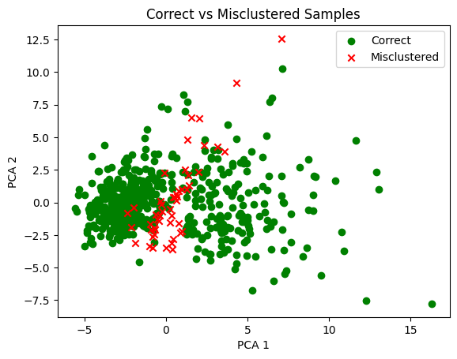

## 📊 Clustering Quality Analysis

The following analysis compares the clustering results with the true labels
(**used only for evaluation, not during training**).

### Cross-Tabulation Result

| True Label ↓ / Cluster → | Cluster 0 | Cluster 1 |
|--------------------------|-----------|-----------|
| Malignant (0)            | 175       | 37        |
| Benign (1)               | 13        | 344       |

### Interpretation

- **Cluster 0** is dominated by *malignant* samples.
- **Cluster 1** is dominated by *benign* samples.
- This indicates that the KMeans algorithm successfully discovered
  a strong natural separation in the data **without using labels**.

### Misclustered Samples

- 37 malignant samples were grouped into the benign cluster
- 13 benign samples were grouped into the malignant cluster

**Total misclustered samples:** 50 out of 569

(569 - 50) / 569 ≈ 91%

### Visualization

The following image highlights **correctly clustered vs misclustered samples**:

> ⚠️ True labels were not used during clustering and are shown here only for
> post-analysis and visualization purposes.

### Approximate Clustering Accuracy

